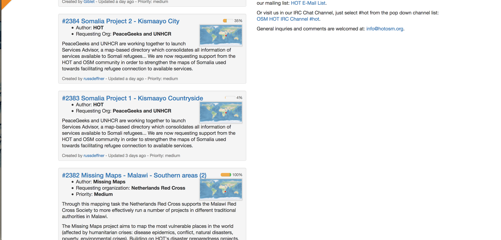

# HOT OSM Task Manager 3 Tech Challenge #

# Application: Nilenso Software LLP (nilenso), a limited liability partnership firm #

1. Introduction
2. About Us
    - 2-1 Our Team
    - 2-2 Our Experience in Development
    - 2-3 Our Experience in Design
    - 2-4 Our Experience in Project Management
    - 2-5 Process / Collaboration / Communication
        - 2-5-1 Inception
3. Implementation
    - 3-1 Design
    - 3-2 Development
        - 3-2-1 Tech Stack
        - 3-2-2 Documentation
        - 3-2-3 APIs
        - 3-2-4 Reuse of Code
4. Timelines
5. Proposed Feature Additions
6. Our Future
7. Appendix
    - 7-1 Team Staffing Plan
    - 7-2 Sample Stories
    - 7-3 Sample Timeline

## 1 Introduction ##

Throughout this application, we hope to address all questions and concerns outlined in the Task Manager 3 (TM3) Tech Challenge (TM3TC). Our team is familiar with HOT, has participated in several mapping events organized by the local OSM community, and is particularly well-equipped to handle both the technical and non-technical challenges of the TM3TC. Our company also has a very specific vision of progressively delivering more of our work as open source, preferably around open data, with each project we take on. When we evaluate, sell, and staff projects at nilenso it is rare to come across one so well-aligned as this. We are very excited to apply to the challenge!

## 2 About Us ##

nilenso is a boutique software consultancy based primarily in Bangalore (India). In our 3-year history, we have built large machine learning, analytics, streaming data, experimentation, and mapping/transportation systems. We continue to run the largest of these systems in production for our clients today. You can read more about our recent work at:

> http://nilenso.com/recent-tech.html.

Our designers and developers speak regularly at conferences, the talks that were recorded over the years can be found here:

> http://nilenso.com/talks.html

### 2-1 Our Team ###

Our team consists of software developers and project managers with decades of experience delivering modular code on lean/agile teams, employing practices which have evolved with the industry over the past two decades.

Our industry experience spans a wide range of verticals: from defense and policing to healthcare, transportation, and climate change. The languages we are familiar with (based on experience within, as well as prior to, nilenso) include Java, Ruby, Python, C#, JavaScript, C/C++, Clojure, Haskell. Collectively, we have made contributions to major open source projects like The GIMP and GNOME.

Members of our design team are familiar with the OSM ecosystem, participate in HOT, and are dedicated tree-mappers of Bangalore. They understand and have experience working with open data systems. (Details are provided in later sections of this document.)

Our project managers have led teams of dozens of developers, locally and across the globe. We have both built software teams by managing hiring and staffing decisions and by consulting, to enhance existing teams or recover failing teams. PMs at nilenso have an engineering background but realize "projects" are not limited to software repositories or consulting contracts. The word encompasses any significant cooperative activity in which human beings engage.

If we are awarded this project, we intend to staff people from each of these disciplines on TM3.

### 2-2 Our Experience in Development ###

We have experience that is relevant to HOT, OSM, and the Task Manager Challenge.

We have built services and infrastructure within the Staples SparX machine learning team for over 3 years. Staples' Experimentation Platform (EP), in particular, is entirely designed, built, and operated by nilenso. EP handles many terabytes of streaming data at a rate of 500 requests per second under a Service Level Agreement (SLA) of <10ms in the 99.9th percentile. Akshay Gupta (@kitallis, on Twitter/IRC/Slack) currently leads the EP team and would be our tech lead for Task Manager 3.

We have presented on the Experimentation Platform architecture at Functional Conf 2015:

> https://www.youtube.com/watch?v=YjfXhhxw9Bs

EP also involves nontrivial database clustering techniques, which have evolved with the lifespan of the project. Synchronous replication, failover to standby databases, ZFS snapshots, custom PostgreSQL MVCC AUTOVACUUM configurations, WAL streaming, realtime (non-star-schema) reporting replicas, DB and I/O monitoring, partitioning, logical replication, load balancing, and multi-mode failure detection all must be understood by every member of our team working on database clusters.

We have presented on building a PostgreSQL DB cluster at Rootconf 2016:

> https://www.youtube.com/watch?v=sGJDg5ba0iI

We have contributed to monitoring infrastructure in many recent software projects. This includes system-level, JVM-level, application-level, and DB-level monitoring on all of our projects. We have been allowed to release some of the DB and DB monitoring work as open source. All of these repositorires are focused on PostgreSQL:

> - https://github.com/nilenso/honeysql-postgres (not monitoring specific)
> - https://github.com/staples-sparx/wonko
> - https://github.com/staples-sparx/wonko-client
> - https://github.com/staples-sparx/pg-cluster-setup
> - https://github.com/staples-sparx/repmgr-to-zk
> - https://github.com/nilenso/postgresql-monitoring

Unfortunately, although we have implemented internationalization (i18n) and built or extended translation tools on a number of projects, very little of this work is open source.

Similarly proprietary is our most recent legacy replacement work on the driver allocation service for an Indonesian Uber competitor. We rewrote this service in Clojure with an extensive generative testing suite (and minimal unit tests for single-value edge cases). Thanks to generative testing and developer discipline, the service was released with zero production issues and completely replaced the legacy software on its first day in production.

This was not our first Clojure rewrite, however. We also rewrote Staples SparX's configuration management, legacy data feed integration, and reporting tools in Clojure. This work involved a different style of testing. First, these services were built with large and comprehensive unit test suites for all known use cases. Then the new services were delivered alongside the legacy (Ruby) services in all environments and validated for multiple months. Once the Clojure services produced results consistent with the legacy services (as confirmed by automated validation software provided by us to the QA team), 3rd party services were redirected to new APIs and the legacy services were turned off. This process was slow but not expensive and finished without a single interruption to existing clients.

Developers from nilenso have also run training and courses in ReactJS, Haskell, and Clojure.

### 2-3 Our Experience in Design ###

Our small design team led by Noopur (@9porcupine on Slack/Twitter) and Varun (@irrational_pai) has also produced a lot of impactful work in a short span of time. They are currently working with Samanvay Foundation; designing a mobile application that helps ground-forces in rural areas quickly diagnose (with the help of an on-board medical professional) basic health issues and audit all the patient information. All their work has been open source since day one:

> - http://samanvayfoundation.org
> - https://github.com/OpenCHS
> - https://goo.gl/dfSOAs (designs are in-progress)

They have experience conducting research to understand the needs of the user as well as their behaviour in the form of:

- Contextual inquiry: with a focused set of users, by giving them specific tasks to perform, observing their behaviour and talking to them further about their actions during the exercise, in order to better understand their mental model.
- Task Analysis: of major tasks, along with the intent to understand and further reduce complexity in workflows.
- Persona creation, as well as focus group discussions and interviews to understand our target audience better.
- Certain tools such as http://www.inspectlet.com/ and
https://www.hotjar.com/ record user interactions in a non-intrusive manner, and can be used for better testing on the web.

Our designers are also familiar with user testing methodologies (either prior to launch of a new product or to test acceptance of new features) by creating mockups and prototypes using prototyping tools.

In addition, Noopur is a proper mapping enthusiast. Apart from participating in the local mapping parties, she's contributed a tourist map of Uttarakhand on Wikipedia and helped build an interactive AQI map on top of OSM, after the recent pollution level spike in Delhi:

> - https://goo.gl/824oOI
> - http://ocsidlab.github.io/earthmap/#4/21.15/79.08

### 2-4 Our Experience in Project Management ###

Deepa (@deepa_v on Twitter, @deepa on Slack) and Steven (@deobald on Twitter, @steven on Slack) are our two project managers. Project Management has meant many different things on our many projects. Since we are uncertain which variables will weigh most heavily on the HOT TM3 project, we will provide a few examples.

Our first, and possibly most substantial project, is nilenso itself. Deepa joined us as an Executive over one year ago, balancing our budget, forcing every implicit decision out into the open, deftly facilitating conversation where others' expertise was most valuable and asking incisive questions everywhere else. Before nilenso she ran a travel product and a manufacturing company. She has now overseen a number of projects at nilenso, both consulting and internal.

Most projects at nilenso have been managed by Steven in one aspect or another: communication, budgeting, staffing, architecture, estimation & planning. He has led software teams for a decade across the Americas, Europe, and Asia. He has run project Inceptions (discussed in the next section) as short as one day for a small nonprofit and as long six weeks for a data warehousing company looking to redefine its entire vision.

We have used our business modelling experience to help a local orphanage with self-sustainability. We have saved weeks of lost time from large projects which simply lacked a clear glossary. (HOT is already has one small, clear example of this in the  "task" vs. "tile" vs. "square" issue; by making the lexicon activity explicit, we can help uncover many more such examples.) We have dealt with issues at all levels and we do not shy away from difficult conversations. For some projects, most conversations are about the budget. For others, they are about a team member who just isn't working out. Regardless of issue, addressing it openly and honestly is always more important than its specifics.

For many clients, the most important work we do is on communication. Three contrasting examples may help illuminate. Last year, two projects (for one client) required daily video calls for one and a self-directed team communicating only once a month for the other. The third example is a local team with whom we have shared offices, both theirs and ours, here in Bangalore. Effective communication in these three cases was about finding what worked best for everyone involved. No single communication solution will work for all projects. Communication is where we spend most of our time facilitating projects, so we will cover that in more detail below.

### 2-5 Process / Collaboration / Communication ###

Our work has moved us around the country and around the globe, operating in and across many different timezones, with many different project management styles, in a variety of toolchains[1].

Our default delivery style is based on the classic Extreme Programming methodologies with 1-week iterations, daily standups, TDD, pair programming, and heavy communication. Progress on individual features/stories/cards would be updated in real time (daily) so stakeholders can watch work in-flight.

We believe that open lines of communication and planning/projection which employs strict measurement and reduces guesswork are critical to the success of any project, so one of our first objectives would be to document all stakeholders (or as many as possible) to ensure the graph of communication was not only open along the channels themselves, but also transparent from the outside, as a whole.

Because of nilenso's offshore and distributed history, we are very familiar with asynchronous communication channels, discussing issues and ideas over a multitude of channels.

Specifically for TSM3, we would ideally suggest identifying an individual or group of individuals who would assay the role of approver / facilitator / gatekeeper. In other words, someone who would take responsility for owning prioritisation and approval. From conversations on HOTOSM Slack, it appears the key person here is Blake Girardot, with some engagement from other community stakeholders.

Another important aspect of collaboration will be that of nilenso with any other community contributors. As TM3TC encourages individual community contributors to apply, we similarly want to encourage a mixed-mode award of the contract. We would be more than happy to work with a contributor(s) who has more experience with HOT or OSM in general, either as an active community member or active contributor to HOT tools.

While we are applying for the entire Scope of Work (SoW), we happily acknowledge that this may not be possible or optimal.

A group approval and prioritization process is possible if it is executed in real time, and we would strongly recommend one such process which we have used to great success on many projects: a project Inception.

[1] We are intimately familiar with most of the project management tools out there: _Pivotal Tracker_, _Mingle_, _JIRA_, _Trello_, paper-stickies-on-a-wall, and of course, _Github_.

#### 2-5-1 Inception ####

An Inception is a high-intensity kickoff to a project, which captures a shared understanding of the high level goals, their priorities, their budgets, and their limitations. The remainder and majority of the Inception then attempts to capture features (or "user stories", preferably, as these frame each feature in terms of how it benefits the end user), estimate them if necessary, and prioritize them. Whether stories are individually estimated or not, they are then packed into a few sample weeks of the project to rough out the expected pace of development. With this initial projection, 4 months worth of TM3 stories can be laid out in priority order and we will know roughly how much the team feels they can accomplish in that period.

Stories can be reprioritized as the project progresses and the initial projection will be updated every week with the team's actual rate of progress. The project's scope is adjusted every week accordingly.

During the project, new feature requests can come from the stakeholders through the various channels into a structured approval and prioritization process. If all cards/stories are ordered by priority from the beginning, it will be easy for the team to collectively prioritize (or for an authority to individually prioritize) individual stories against that total ordering.

## 3 Implementation ##

### 3-1 Design ###

The nilenso Design team will participate in the development of TM3 with the aim of answering all 4 major user-facing goals laid out in the TM3TC, but Goal 3 is of utmost importance: "a significantly improved UI/UX" means progressively working toward the core of the Task Manager by first eliminating any pain experienced by users.

Designers will be key in ensuring the software team is building what users need and what the community wants. We will participate in discussions about improving experiences, like those mentioned above for Mappers, for all HOT roles. The proposal and approval process will involve Design early on, from Inception to the fleshing out of each user story. During the Inception, we will facilitate discussions around a cohesive, overarching design. When defining each user story, designers will describe the specifics of all physical aspects of the software: appearance, interaction, and time.

The Design team will own the conducting of user experience testing, whether that happens in the HOT testing environment online or in offline testing such as cafe tests for new users who are completely unfamiliar with HOT, OSM, and their respective software ecosystems.

### 3-2 Development ###

#### 3-2-1 Tech Stack ####

We propose writing TM3 in Clojure. There are a few major reasons for this:

-  Thanks to the JVM, Clojure affords quite a few _free_ advantages from libraries (though Python is also healthy in this regard) to tunable/swappable garbage collectors to plug-and-play analytics and production monitoring to pluggable profiling tools. Millions of person-hours have battle-hardened it as a platform. It's unlikely that the JVM is to be surprassed as a platform, virtual machine, or suite of GCs anytime soon.

- The Java/Clojure ecosystem comes with high-performance JDBC/Postgres drivers that have good support for PostGIS. As we've mentioned earlier in this proposal, we have extensive experience in dealing with Postgres and have written quite a few Clojure tools around it.

-  The existing software (TM2) has serviced the community well, but we have observed a few issues with the current architecture. The Python/JavaScript codebase has no real layering. All server-side components are built into _views_, which perform most of the domain logic and manage state transitions through user workflows. We don't insist that MVC, MVP, MVVM, or any other such acronym is the only way to build web apps/services. However, at least one separation of server-side layers is often wise and TM2 would benefit from a more modular design. Because of this conflation of responsibilities, the test suite is a bit cumbersome (though very thorough!). The incidental complexity of the Python code led us to run Radon over the codebase to get concrete metrics on cyclomatic complexity. 286 of the Python methods receive a grade of "A", 15 receive a "B", and only 2 receive a "C". Granted, we would consider a "B" from Radon a failing grade. `osmtm/views/tasks.py#send_invalidation_message`, for example, receives a "B" with a CC score of 7, which we would consider very high. Still, the entire codebase is certainly amenable to refactoring.

- We're equally comfortable rewriting this in Java, but there are solid reasons to pick up Clojure as a language, beyond the JVM:
    - It imposes a much more disciplined approach to functional programming. There's immense value in statelessness, immutability, concretized notions of time and STM. Even though it can be partly captured even in object-oriented and dynamic languages like Python and Java, Clojure has clear delineations between pure functions and those which produce side-effects. Immutable, functional code is much easier to reason about, which means this value translates into speed of development, not just correctness of the program.
    - Where immutable data structures and FP don't eliminate bugs, Clojure's REPL-driven development allows easy inspection of server-side data structures. The production diagnostics process in Clojure is quite different from other languages and does not require recreating a failure scenario from scratch. Thanks to the ability to snapshot a live JVM, a failing system can be instrumented and inspected repeatedly, offline. In addition to correctness and robustness of systems, this has huge implications for resolving performance issues.
    - Clojure operates at a very high level of abstraction. All collection types in Clojure adhere to the same interface, with well understood behaviours. For this reason, highly abstract core functions (such as treewalks, zipper navigation, high-level filtering, merging, and aggregation) are usable everywhere and quickly add to a team's productivity. Newer features like Transducers take this universal abstraction up one level higher.
    - Developer testing may be better in Clojure than in almost any other language at the moment. Every form of unit testing is supported in the Clojure ecosystem (classic TDD, BDD, mini, etc.), generative testing has had a healthy following in the Clojure community for years, and `core.spec`[1] takes this a step further by unifying unit testing, generative testing, executable documentation, interface schema, parsing errors, validation, and instrumentation.

- We are not Python experts and we would venture a guess that it would take us longer to become fully proficient in the Python ecosystem (tools, libraries, idioms etc.) than it would take us to rewrite the fairly thin 4000 lines of Python in TM2's server-side code. It goes without saying that it would be a natural part of this rewrite to guide the current set of contributors through the language and set appropriate contribution and language guidelines early on in the project.

- A side benefit of rewriting TM3 from the ground up is that the design surrounding APIs can be revisited. Rather than APIs on top of the application layer, as TM2 has implemented, the service exposing APIs could run behind the service exposing the application. This ensures every behaviour of the application must have an associated API and no API will ever go unimplemented. While not the approach we recommend for TM3, we have also written applications with no server-side application component at all. These apps leave UI logic entirely in JavaScript and the server _only_ provides APIs.

However, we'd rather tread carefully and **not** marry ourselves to this proposition. We caveat our own argument for Clojure by being well aware of the fact that the community is used to contributing in Python, and Clojure lacks the mindshare Python has. In some of our client projects in the past, we have followed a process of refactoring the existing codebase, redesigning a new one, and rewriting it in Clojure. Since we have finite time and budget, it makes sense to refactor (as necessary) and implement the proposed features. If needed, we're also completely open to talking about it outside of this document, since it's better decided as a conversation with the community and the stakeholders.

Regardless of language and stack, our infrastructure, automation, and deployment approach is always built on top of an OSS toolchain. Last year, for corporate political reasons, we had to move all of our services for one client from AWS to a "private cloud". Had we built anything AWS-dependent, this process would have been impossible.

Monitoring is essential for every project. We run own our software in production from our first deployment, and we try to make that first deployment happen as early in our involvement as possible. Operations ("devops", these days) is a group effort but we are often the first or second point of contact for services we build exclusively. Deploying production monitoring, no matter how simple, early in a project's lifecycle is a non-negotiable part of shepherding software in production.

> [1] http://clojure.org/about/spec

#### 3-2-2 Documentation, Automation, Testing, Deployment ####

All of our software is thoroughly documented. We not only create user documentation (which is then validated by users as each individual new feature is continuously delivered into production) and developer documentation in the form of in-repository documents, in-line comments (where the domain, abstractions, or algorithms may be confusing), and thorough test suites. We also strive for self-documenting code, verbose and meaningful commit messages on atomic (transactional) commits, short-lived branches, a master branch which is always green and deployable, and a continuous integration (CI) system which not only alerts developers to broken builds but provides proactive insight into deployment and environmental failures. This is done by creating a CI environment which is nearer the production environment than the development environment, where this makes sense. The more of this documentation which can live in version control (we prefer Git), the better.

Major architectural decisions will be captured within the version control system as Architectural Decision Records (ADRs)[1] in an immutable, linear fashion. Every software project should contain a README which serves as the _only_ point of entry required for a user, sysadmin, or new developer. Where documentation is not possible (for passwords, keys, and other secrets) the team members responsible are called out explicitly in either documentation -- preferably within the README itself -- or through automation tools at the point where interjection is necessary. A new user (playing a "sysadmin" role) should be able to install any piece of software with a single package or script for installation. With respect to operations in canonical environments (say, http://hotosm.org) this automation should include provisioning and orchestration.

Unit, integration, functional, and acceptance testing is a part of the development process and a story isn't complete (or even deployable) until it is covered by automated tests. Simulation testing is a bit different and does not necessarily happen in lock step with development. User testing obviously cannot happen until a story is deployed to a testing or staging environment. This is generally also true of cafe testing, to avoid having new users test software that hasn't been proved deployable on production-like infrastructure.

Comprehensive load, integration, acceptance, and unit tests are a good indication of a healthy software project. In recent years, we've started to grow away from these practices to some degree. Load testing can often be completely automated and with small, simple, custom tools and can become a part of CI or even Contiuous Deployment (CD). Integration tests should not be a one-way street and within an integrated service architecture, client-driven service contracts provide integration tests which not only ensure narrowly-defined API correctness but facilitate communication and provide early alerts to both parties when API contracts are accidentally violated. Consumer-Driven Contracts[2] are not as common in the industry as one might expect, and we welcome questions about how we have used them in the past.

Complex systems, such as the Data Science Experimentation Platform (EP) we have built for Staples for over 3 years, can be integration tested with much higher fidelity using simulation-based testing. Simulation tests combine the power of generative testing, explicit system state transitions, and system-wide integration testing. Less expensive than full-blown simulation testing is component-level generative testing using tools like Clojure's `test.check` to replace hand-written unit tests with dynamic and automatically generated tests. Unit tests and TDD still serve to refine component design and test very specific edge cases. You can watch Nivedita and Srihari discuss the EP architecture and simulation testing strategy in their Functional Conf 2015 talk here:

> https://www.youtube.com/watch?v=YjfXhhxw9Bs

All of the above of course assumes not just a high level of automation but _complete_ automation. To comprehensively test entire architectures with dynamically generated scenarios and interaction simulations, it must be possible to instrument and script the entire set of services. Often, this means that services are built "API first" to accomodate testing infrastructure in the way that object-oriented systems tended to be built "interface first" in the 1990's and early 2000's when TDD and unit testing really took developer mindshare. Though some projects we deliver continue to leave provisioning of hardware to the sysadmin team, absolutely everything else (orchestration, down) must be completely automated and scriptable or high-functioning testing strategies are impossible. The yin and yang in this situation is again reflective of bad modeling corrected by TDD and unit testing: If we try to write a test and get hung up on a manual process, the first thing we'll do is automate it.

[1] ADRs: https://goo.gl/HFjhsh
[2] http://martinfowler.com/articles/consumerDrivenContracts.html

#### 3-2-3 APIs ####

For over two years, the majority of nilenso's software delivery has been on systems with API front-ends. We are very familiar with growing APIs, managing API versions, defining "easy" APIs alongside "performant" APIs, and API-first development. We all appreciate a line of code is expensive to change, a database schema is much more expensive, and an API schema much, much more expensive than that. Particularly for APIs with unknown clients, "up-front design" is not a dirty term in any sensible agile team.

We see there are five major APIs pending in the existing TM2 software [1]:

1. Task Details
2. Validate/Invalidate
3. Lock/Unlock a task
4. Create task by position
5. Create task by geography

None of these implementations looks particularly difficult and if we were to extend the TM2 codebase as-is, implementing draft versions of these APIs may be a good way to familiarize ourselves with the TM2 build/deploy process and overall design.

As mentioned above with regard to integration and simulation testing, it is often necessary in modern service architectures to design APIs "outside-in" for the sake of facilitating testing, even before the API has any clients.

In our experience, one major quality of well-designed APIs is a clear and explicit awareness of where and how state transitions occur. Objects and data structure instances are inherently state machines. Entire systems are no different, though it is extremely difficult (and inefficient) to make an entire system immutable, which means state transitions across systems are mutative and it is all the more important to capture state transitions for every API call which writes to a service.

It has only been implied until this point, but to make the point absolutely explicit: We will create APIs early with clear definitions, with the intention of facilitating both testing and integration with other HOT software products. Goal 5 from the TM3TC will be addressed continuously throughout development.

[1] https://github.com/hotosm/osm-tasking-manager2/wiki/API#tasks

### 3-2-4 Reuse of Code ###

"Reuse" for us is much more about clean design -- well-defined service boundaries, appropriate library usage, and logical abstration -- than it is a goal unto itself. Software and team performance are both consequences of a clean design, not the other way around.

## 4 Timelines ##

Prioritizing user stories and non-functional requirements (collectively, "cards") will be a collaborative effort with key stakeholders. If high-level feature groups interleave priorities, "milestones" may simply be markers showing overall progress. Only if priorities and groups of features line up will thematic milestones emerge; we would recommend against forcing the concept of milestones into the delivery schedule as they only provide observers with emotional satisfaction but do nothing to structure a project more effectively. We prefer continuous delivery.

With that caveat in place, the following timeline provides a rough milestone-based outline of what the project may look like. The actual order of development and delivery will depend on weekly Iteration Planning Meetings (IPMs) led by the project manager to discuss feedback and prioritize stories / features through the duration of the project.

### Month #1 ###

- Identify key stakeholders/contributors, set up daily/weekly online meetings
- Inception phase 1: stories for rewrite
- Begin API+app Clojure rewrite to make system modular, exposing APIs for each behaviour
- Inception phase 2: stories for new features
- Design team begins redesign of pain points

### Month #2 ###

- Deploy the rewrite in sandbox and begin testing
- Design team focuses on (new) Mapper workflows and ease of use
- Messaging / chat application for Mappers and Validators
- Simplify Validator workflows (multi-tile validation, feedback suggestions, priority lists)

### Month #3 ###

- Design team focuses on power user (Validator & PM) UIs and features
- Build PM dashboard / control panel
- Incorporate new designs across tools (both TM3 and 3rd party) and build front-ends
- Build analytics tools for Validators and PMs

### Month #4 ###

- Build auto-suggestion UIs which integrate OSMA
- Simulation / Perf testing suites
- Finish pending documentation
- Handoff

In the appendix, we provide a sample set of stories and sample story-based timeline after that. Though this list is in no way exhaustive, this sample timeline is much more realistic in terms of granularity used for planning.

It should be noted that the sample story list does not assume enhancement of TM2 or a from-scratch server-side rewrite, including sample cards from both options. Therefore, a reader may notice some stories which describe functionality TM2 already provides.

## 5 Proposed Feature Additions ##

Between the Github issues and the ToR, an excellent list of suggestions is already available. It appears there are a few areas which would be quite impactful:

1. **Expose all TM3 behaviour by auth-based APIs.** If possible, users should not need to leave their preferred OSM editing environment (JOSM, iD) to complete their work on tiles and contribute to larger projects. Though elided from the cards in Appendix 6-1, new authenticated mutative APIs will involve contributing code directly to tools like JOSM to ensure a full spike through the system, from the user's tool, through TM3's APIs, into project data. The best user interface feels like none at all.

2. **Report User- and Project-level statistics.** This may take the form of a complete Project Manager dashboard or these metrics could be integrated into the existing Project Manager and Validator workflows. For example, visual indicators (our designers can come up with specifics) could identify inexperienced vs. experienced Mappers to Project Managers to help guide them toward tiles of appropriate difficulty. When this information was presented to Validators, it would help them gauge what granularity of validation was required for a tile.

3. **Add powerful Project/Group creation and administration.** The most direct and TM3-specific feature-set will be interfaces for project/group creation and administration. Though much of the Mapper- and Validator-facing functionality will hopefully move to tools on the edge of HOT/OSM architecture via TM3 APIs, projects and groups of projects are concepts which are rooted in the Task Manager and the unified UI is likely to continue as a feature of the web app. While the primary goal of the user experience for Mappers will be ease and elimination of friction, the goal for Administrators and Project Managers will be power and flexibility. Administrators are not new to OSM and do not require "conversion" to the process; the PM interface of TM3 may forsake time-consuming investment in slick UIs and an easy user experience for richer, heavily-documented features.

4. **Simplify validation.** Experienced Validators often validate across a holistic map, rather than tile-by-tile. When doing this, the Validator UIs should allow them to select tiles they have reviewed in bulk before marking them "validated", rather than forcing repetetive behaviour. Not only will this make the Validator workflow faster, it will help retain Validators by avoiding tedium.

5. **Provide chat / messaging everywhere.** This way, Validators can guide Mappers directly. This provides a middle-ground between "accept" and "reject" for a Validator deciding if a tile is done correctly, and allows them to provide this feedback earlier. Receiving a "reject" status after putting effort into a tile is demotivating, particularly for inexperienced Mappers.

6. **Explain tile skills to potential Mappers.** Every tile is a puppy at the pound, waiting for a new owner. The difficult ones require someone with experience and patience. The gentle, easy ones are best saved for someone whose confidence will be boosted by early success. Since most work in HOT is self-selected by Mappers, the best solution to this matching problem is to provide Mappers with as much information as possible. Tags should be searchable/filterable and Mappers should be able to self-identify their skill level (the way one does at a ski hill: Beginner, Moderate, Aggressive) so a helpful list of potential work can be presented to them. The flip side of this user interface is, of course, an easy way for Project Managers to tag and flag available tiles.

7. **Include demos with corresponding tasks.** If a particular tile requires a specific skill (as laid out by the TODO/checklist), the creator of the tile can also include an embedded/linked demo or instruction to help guide new Mappers. The available list of embedded/linked help could be prepopulated with common activities (and their pitfalls) so tile creators could add them easily or even automatically. Project Managers and Administrators could edit this prepopulated list. Examples of instructions and demos include:

> - http://learnosm.org
> - https://youtu.be/Ir-3K0pjwOI?t=6m36s
> - https://www.mapbox.com/blog/tags/openstreetmap-101/

8. **Make better use of Project list screen space.** Sometimes small, inexpensive changes provide huge returns. The Project list screen consumes the right-hand 50% for an introduction to the Tasking Manager, OSM, and HOT. After scrolling past this first screen, this screen real estate is lost.

\newpage

## 6 Our Future ##

At nilenso, we try to constantly ask ourselves what progress looks like and how we can contribute to the world we inhabit. While each of us may have a preference for a certain domain — the arts, international development, transportation, childhood education — we are all in agreement that technology can have a positive social impact and that we, as a technology co-operative, need to move toward creating that impact with Free Software.

We have had some success in the mission we set for ourselves. We have designed mobile user interfaces for India's rural hospitals with Samanvay. We have built citizen education platforms for fighting climate change with Fact0ry and mobile apps for detecting water quality metrics with Akvo. These are small projects, however, not yet comprising the bulk of what we do.

Task Manager 3 is a wonderful opportunity. Free maps operate at a very high level in humanity's global progress: countless new tools can be built on OpenStreetMap. Individuals and software teams around the globe are completely unfettered when such systems and data exist. HOT pushes this one step further by specifically targeting rapid improvement of maps for the areas which need them most. The Task Manager, by providing coordination and orchestration of teams, will bring efficiency to a global effort that would otherwise be impossible. TM3 is unlike many humanitarian software efforts we have previously evaluated, which don't involve a lot of data, infrastructure, or domain knowledge. Our experience makes us a good match for the management, design, and development challenges TM3 presents and we believe we will make this project a success.

## 7 Appendix ##

### 7-1 Team Staffing Plan ###

To accomodate the 4-month delivery timeline starting on January 6th of 2017, we propose a staggered roll-on/roll-off plan.

The staggered roll-on of Udit and Akshay accommodates for their current commitments. We will staff them on TM3 earlier, if possible, but at present these are the earliest dates we can guarantee.

Because the Task Manager is a community-driven product, the weeks in May (after the official April 30th release of TM3) would be used to smoothly transition the nilenso team out of daily development. This includes bringing volunteer contributors up to speed, fixing bugs identified by users in late April, and finish any outstanding documentation. We would remain available to contribute and answer questions through various channels after this, of course.

#### January ####

- Week 1: Proposals are evaluated and perhaps nilenso's is chosen
- Week 2: Steven, Deepa, Sandy, and Noopur run a project Inception and design kickoff
- Week 3: Design and development continue with Sandy and Noopur
- Week 4: Udit joins Sandy as the second developer

#### February ####

- Week 1: Akshay joins Sandy and Udit

#### March ####

- Team continues as above

#### April ####

- Team continues as above
- Development team may reduce from 3 to 2, depending on progress

#### May ####

- Week 1: First developer rolls off, if not in April
- Week 2: Second developer & Noopur roll off
- Week 3: Last developer rolls off

### 7-2 Sample Stories ###

A realistic but non-exhaustive sample story list follows. Non-functional requirements are prefixed with _[NFR]_.

> _NB: Since one of the Github issues listed is "Consistency in terminology: tasks,
> tiles, and squares" (https://github.com/hotosm/osm-tasking-manager2/issues/912),
> we will use "tiles" below to mean all three._

* Validator can query list of hints in TM3 of tiles where OSMA anticipates an error/mistake
* Mapper will be automatically notified when OSMA anticipates a common mistake on the tile the Mapper is currently editing
* PM/Validator can see # of changesets for a Mapper
* PM/Validator can see # of complete tiles for a Mapper
* PM/Validator can see days since account activation for a Mapper
* PM/Validator can see # of days of active mapping for a Mapper
* PM can view an aerial map of historicaly, current, and new project space by geography
* PM can view a map displaying active and historical projects
* PM can clone a project to create a new project with defaults
* PM/Validator can observe changes made by a Mapper in real time to provide early feedback
* Mapper can self-assign a tile to herself
* PM can assign a Mapper to a tile
* PM can mark a Mapper with a "Validator" role for a project
* PM can create a project group
* PM can add/remove projects to/from a project group
* PM can see current and historical project groups
* PM can mark a project group completed
* PM can mark a project completed
* PM can see nearby/intersecting projects on the project creation screen
* PM can see nearby/intersecting projects on the project summary screen
* Mapper can provide in-app feedback about aspects of mapping they find confusing
* Mapper can make a generic request for help to a Validator
* Validator is notified when a Mapper is identified by OSMA as needing help
* Validator can see a prioritized list of tiles requring validation
* Validator sees likely error-prone tiles highlighted by OSMA in the prioritized list of tiles requiring validation
* Validator can send Mapper quick feedback from a predefined set of common issues
* Validating a tile acknowledges the Validator for that task
* Validator can mark a tile validated in JOSM (implies corresponding API)
* Mapper can optionally add an email id to her profile
* Validator feedback is sent to Mapper's email, if available
* [EPIC] TM3 should provide an API for custom analytics queries (See ToR note "Laura O'Grady 12:38 PM Nov 24")
* PM can set expiration period on a tile; tile auto-expires at the end of the period
* PM can assign a difficulty to a tile
* PM will see auto suggestions from OSMA when assigning difficulty to a tile
* Any User can see aggregate analytics on tiles for all of OSM
* Any User can see aggregate analytics on tiles for a project group
* Any User can see aggregate analytics on tiles for a project
* Any User can see aggregate analytics on tiles for a user
* PM can see a list of Mappers for a project
* TM3 should support 100,000 simultaneous users on XYZ hardware (this card may be defined in terms of N users per M hardware nodes, assuming performance tests are published displaying linear horizontal scalability and the failure conditions for horizontal scaling)
* [NFR] Any API user can read a live data stream of activity from TM3
* PM can view a summary of projects & statuses by geographical area
* PM can adjust tile size to accommodate varying complexity/difficulty
* [NFR] Finish pending TM3 API endpoints for existing features (See TM3TC "Goals" 5.)
* Validator can ask a question of a Mapper for tile she is validating
* Mapper can view a TODO/checklist for her current tile
* Mapper can see a prioritized list of task squares available to work on
* [NFR] TM3 must support i18n
* [NFR] Any user can submit a translation or update to a translation for review
* [NFR] Mutating API calls must be authenticated
* Mapper/Validator can request access to a private project
* Mapper can mark a tile as "too cloudy to complete"
* Mapper can mark a tile as "imagery insufficient to complete"
* Mapper must review & certify TODO/checklist complete to mark tile as "done"
* Mapper can stop working on a tile to unlock it without marking it "done"
* Any User can subscribe to notifications for all comments made on a tile
* Mapper receives a "Welcome to HOT mapping" email upon first login
* Mapper receives a buffer around tile area when beginning work on a new tile

### 7-3 Sample Timeline ###

The cards in the above list are not of a consistent size. "TM3 should provide an API for custom analytics queries", for example, is marked "[EPIC]" because it is substantially larger than all the other cards in the list. Before delivering such a card, it would need to be broken down into relatively similar-sized cards (to each other and to all other cards in the list). If the team finds it difficult to apportion cards in roughly similar sizes, cards may be given relative estimates, in abstract points: 1, 2, and 3. "1" describes a nearly-trivial task. "2" is the preferred difficulty for most cards. "3" represents work which cannot be subdivided into cards of size 1 or 2.

For this exercise, let's assume we were able to apportion cards of roughly equivalent size for all 58 cards above. The aforementioned API epic, "Validator can mark a tile validated in JOSM", "TM3 should support 100,000 simultaneous users", and "[NFR] TM3 must support i18n" are all obviously larger cards. Let's assume these 4 cards are broken down into 16 smaller cards we consider roughly equivalent to the rest of the list. If we provide the prioritized list to the software team, they can then plug cards into the first few weeks of development to estimate their week-on-week accomplishments. Say the first week fits 5 cards, the second week 7, and the third week 6. The sizing of effort in this exercise is fine-grained enough to be possible for a human being to estimate but coarse-grained enough to be meaningful on the 4-month project timeline. Our 70 cards will take 12 weeks to complete, leaving 4 weeks buffer for scope creep, underestimation, manual QA, and unanticipated communication/feedback inefficiencies.

The timeline from our sample inception might then looks like this:

#### January ####

Week 2

* [NFR] Finish pending TM3 API endpoints for existing features
* [x4 / NFR] TM3 must support i18n
* Mapper can self-assign a tile to herself

Week 3

* PM can mark a Mapper with a "Validator" role for a project
* [NFR] Mutating API calls must be authenticated
* [x4] Validator can mark a tile validated in JOSM

Week 4

* [NFR] Any user can submit a translation or update to a translation for review
* PM can assign a Mapper to a tile
* PM can clone a project to create a new project with defaults
* PM can mark a project completed
* Mapper can stop working on a tile to unlock it without marking it "done"
* PM can assign a difficulty to a tile

#### February ####

Week 1

* PM can set expiration period on a tile
* Mapper can mark a tile as "too cloudy to complete"
* Mapper can mark a tile as "imagery insufficient to complete"
* Mapper can optionally add an email id to her profile
* Validator feedback is sent to Mapper's email, if available
* Validator can send Mapper quick feedback from a predefined set of common issues

Week 2

* Validator can see a prioritized list of tiles requring validation
* Mapper can provide in-app feedback about aspects of mapping they find confusing
* Mapper can make a generic request for help to a Validator
* PM/Validator can see # of days of active mapping for a Mapper
* PM/Validator can see # of changesets for a Mapper
* PM/Validator can see # of complete tiles for a Mapper

Week 3

* Mapper/Validator can request access to a private project
* PM/Validator can observe changes made by a Mapper in real time
* PM/Validator can see days since account activation for a Mapper
* PM can see a list of Mappers for a project
* [NFR] Any API user can read a live data stream of activity from TM3
* PM can view a summary of projects & statuses by geographical area

Week 4

* Mapper receives a "Welcome to HOT mapping" email upon first login
* PM can create a project group
* PM can add/remove projects to/from a project group
* PM can see current and historical project groups
* PM can mark a project group completed

#### March ####

Week 1

* Validator can ask a question of a Mapper for tile she is validating
* Mapper can see a prioritized list of task squares available to work on
* Mapper can view a TODO/checklist for her current tile
* Mapper must review & certify TODO/checklist complete to mark tile as "done"
* Any User can subscribe to notifications for all comments made on a tile

Week 2

* Mapper receives a buffer around tile area when beginning work on a new tile
* PM can view an aerial map of project space by geography
* PM can view a map displaying active and historical projects
* PM can see nearby/intersecting projects on the project creation screen
* PM can see nearby/intersecting projects on the project summary screen
* Validating a tile acknowledges the Validator for that task

Week 3

* PM can adjust tile size to accommodate varying complexity/difficulty
* Validator sees error-prone tiles highlighted by OSMA in list of tiles requiring validation
* PM will see auto suggestions from OSMA when assigning difficulty to a tile
* Validator is notified when a Mapper is identified by OSMA as needing help
* Validator can query list of hints (from OSMA) in TM3
* Mapper will be automatically notified when OSMA anticipates a mistake

Week 4

* [x4 / EPIC] TM3 should provide an API for custom analytics queries
* Any User can see aggregate analytics on tiles for all of OSM
* Any User can see aggregate analytics on tiles for a user

#### April ####

Week 1

* [x4] TM3 should support 100,000 simultaneous users
* Any User can see aggregate analytics on tiles for a project
* Any User can see aggregate analytics on tiles for a project group

Week 2

* Development buffer / performance & simulation testing

Week 3

* Development buffer / performance & simulation testing

Week 4

* Production hardening for April 30th offical release

#### May ####

Week 1

* Bug fixes
* Documentation

Week 2

* Staggered roll-off
* Handoff from nilenso to community
* Collaborative development with community members

Week 3

* Final handoff

### Sample Timeline Explanation ###

Without stakeholders, relative priorities are guesswork on our part. However, we have hinted at a few realistic scenarios:

* If the system is _not_ rewritten as an API-backed Clojure application, the very first task we are likely to pick up would be finishing the implementation of incomplete API endpoints.
* Cross-cutting NFRs are likely to be played early on. Internationalization, backing all behaviour with APIs, and authentication for APIs are good examples.
* Beyond bootstrapping cards like cross-cutting NFRs, the first stories played are likely to be simple and foundational features:
    * Mapper can self-assign a tile to herself
    * PM can mark a Mapper with a "Validator" role for a project
    * [x4] Validator can mark a tile validated in JOSM
    * PM can assign a Mapper to a tile
* Conversely, complex features or features which depend on data created by the use of other features are prioritized farther down the list:
    * PM can adjust tile size to accommodate varying complexity/difficulty
    * PM will see auto suggestions from OSMA when assigning difficulty to a tile
    * Mapper will be automatically notified when OSMA anticipates a mistake
* We have intentionally deprioritized features which appear valuable but not essential ("nice to have"):
    * Mapper/Validator can request access to a private project
    * PM/Validator can observe changes made by a Mapper in real time
    * PM/Validator can see days since account activation for a Mapper
    * PM can see a list of Mappers for a project

An experienced and involved community of stakeholders will always know more than we do and working through this sample exercise has made us excited to learn the real priorities of work items for TM3.

The real Inception exercise will be much more involved and collaborative. We hope this Sample Inception provides some insight as to how we would go about it, however.
